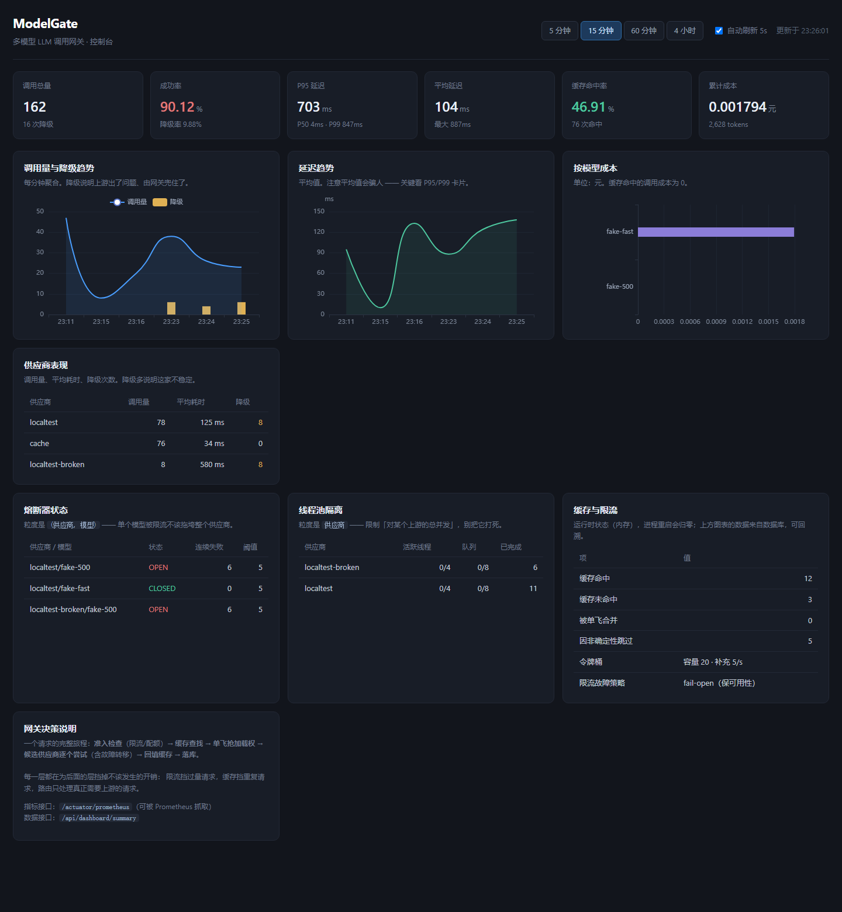

# ModelGate

**多模型 LLM 调用网关：可靠、可计量、可用数据选型。**

[]() []() []() []()

> 仓库地址：**https://github.com/Puzzle-haha/model-gate**

让上层应用只调一个接口，底下自动完成供应商路由、密钥轮询、限流、熔断、降级、缓存、成本核算，并用实测数据回答「这个场景该用哪个模型最划算」。

> 📌 项目范围、里程碑、验收标准见 **[docs/00-charter.md](docs/00-charter.md)**。动手前先看它。

### 文档导航

| 文档 | 内容 |
|---|---|
| [docs/00-charter.md](docs/00-charter.md) | 项目章程：范围、里程碑、验收标准、明确不做的事 |
| [docs/05-llm-resilience.md](docs/05-llm-resilience.md) | 容错实验：9 种故障模式、实验协议、实测数据 |
| [docs/07-loadtest.md](docs/07-loadtest.md) | 压测报告：测量边界、预热方法论、三组对比数据 |
| [docs/08-resume.md](docs/08-resume.md) | 简历文案、逐条拆解、预设追问与不该写什么 |
| [docs/09-interview.md](docs/09-interview.md) | 面试追问手册：20 个高频问题 + 答不上来怎么办 |
| [docs/10-deploy.md](docs/10-deploy.md) | 部署指南：裸机 systemd / Docker、**安全清单** |
| [docs/screenshot-dashboard.png](docs/screenshot-dashboard.png) | 控制台截图 |

---

## 当前状态

**已完成**：M1–M7 全部里程碑（含简历文案与面试手册）
**待办**：部署上线（可选，需自备服务器；文档已就绪，见 docs/10-deploy.md）

章节按时间倒序排列，最新的在前。

---

## M6 · 评测集与模型质量回归 —— 已完成 ✅

### 为什么这一段是整个项目最有价值的部分

写一个能调用模型的接口不难。难的是**回答"这个改动到底让系统变好了还是变差了"**。

LLM 的输出是概率性的：同一个 prompt 今天对明天错，换个模型、调个参数、改一句提示词，
效果都可能变。**没有评测，所有的"优化"都是凭感觉。**

评测系统必须提供三件事：

| 要求 | 本项目的做法 |
|---|---|
| **可重复** | 温度固定为 0；**绕过缓存**（见下方说明） |
| **可量化** | 准确率、成本、延迟都有数字，不是"感觉好多了" |
| **可归因** | 拆到「模型 × 任务类型」和逐题明细，能定位是哪类任务崩了 |

### 实测结果

评测集 12 道题（6 道算术 + 6 道情感分类），三个"能力不同、价格不同"的模型：

| 模型 | 题数 | 答对 | 准确率 | 成本(元) | **每个正确答案成本** |
|---|---|---|---|---|---|
| eval-cheap | 12 | 7 | 58.33% | 0.000240 | **0.000034** |
| eval-weak | 12 | 10 | 83.33% | 0.000936 | 0.000093 |
| eval-strong | 12 | 12 | **100%** | 0.003744 | 0.000312 |

**「每个正确答案成本」才是选型的真正依据。** 单看准确率会永远选最贵的，
单看成本会永远选最便宜的——两者都没有意义。这张表告诉你：
eval-strong 贵 9.2 倍，换来 100% vs 58% 的准确率，**值不值取决于任务对错误的容忍度**。

再看按任务类型拆开的结果：

```
eval-cheap   arithmetic 66.67%   sentiment 50.0%    ← 总分 58% 掩盖了它分类能力接近瞎猜
eval-weak    arithmetic 83.33%   sentiment 83.33%
eval-strong  arithmetic  100%    sentiment  100%
```

**只报一个总分是不够的。** 总分 58% 看不出问题在哪；拆开才发现
eval-cheap 的情感分类只有 50%（等于抛硬币），而算术还能到 67%。
路由决策需要的就是这个粒度——你不想按总分路由，你想按「这类任务该用谁」路由。

逐题明细里能看到具体的错误形态：

```
arith-004  eval-weak   期望=632  实际=633    ← 算错一位
sent-002   eval-cheap  期望=负面 实际=正面    ← 分类反了
```

### 两个必须讲清楚的实现细节

**1. 评测必须绕过缓存**

这是评测里最容易犯、也最隐蔽的错误。如果评测走正常的缓存路径：

- 第一次跑：全部未命中，准确率真实
- 第二次跑：**全部命中缓存**，准确率变成 100%

而你测的根本不是模型，是缓存。更糟的是这个错误**看起来像好事**
（"准确率提升了！"），能骗过好几个迭代才被发现。

所以 `chatForEval()` 显式跳过缓存和限流（评测是内部批量操作，
几十上百次调用会立刻撞上为外部租户设的限流），但**保留容错层**——
评测也应该反映真实的容错行为。

**2. 任务必须有唯一、可自动判定的答案**

如果评测需要人来判断"这个回答好不好"，那评测就跑不快、不可重复，
换个人评结果就变了。那样的分数没有决策价值——你只能说"我感觉 A 好一点"。

真实项目里当然也有主观任务（写作、总结），那些用人工标注的小样本
+ LLM-as-judge 来评。但**先把客观题的闭环跑通，才有资格谈主观评测。**

### 打分器的归一化边界（容易做错）

模型输出的 `19`、`19。`、` 19 `、`答案是 19` 在语义上是同一个答案，
直接字符串比较会把后三个判错。结果就是：**你测出来的不是模型能力，
而是"模型有没有按你的格式要求输出"**。

所以打分前要做归一化：去首尾空白、去句末标点、全角转半角、统一大小写。

但**不能过度归一化**——把「正面」和「负 面」也当成一样，就把真正的错误判成对了。
归一化到什么程度，取决于任务的语义边界。这是个需要判断力的地方，
没有放之四海皆准的规则。

### 接口

```
GET  /api/eval/fixtures                     查看评测集内容
POST /api/eval/run?models=A,B,C             跑一次评测
GET  /api/eval/runs                         历史运行列表
GET  /api/eval/runs/{id}                    完整报告（含按模型/按类型/失败明细）
GET  /api/eval/runs/{id}/results?model=A    逐题明细
```

评测是同步执行的——当前规模（12 题 × 3 模型 = 36 次调用，2.7 秒）足够。
任务数上去之后应该改成异步：提交返回 runId，前端轮询进度。
**先做对，再做快。**

---

## M5 · 可观测性与 Dashboard —— 已完成 ✅



| 能力 | 状态 |
|---|---|
| Prometheus 指标（`/actuator/prometheus`） | ✅ 225 行自定义指标，含百分位直方图 |
| Micrometer Timer（P50/P95/P99） | ✅ |
| 控制台页面（原生 JS + 本地 ECharts） | ✅ 深色主题、5s 自动刷新 |
| 窗口内统计（可回溯历史） | ✅ MySQL 窗口函数算百分位 |
| 运行时状态（熔断器 / 线程池 / 缓存） | ✅ |

### M5 实测数据

控制台第一屏的真实数字：

```
调用总量 162  成功率 90.12%  降级率 9.88%
P95 703ms     P50 4ms        P99 847ms    平均 104ms
缓存命中率 46.91%（76 次命中）
累计成本 0.001794 元 / 2,628 tokens

供应商表现:  localtest 78 次/125ms/8 降级
            cache    76 次/34ms/0 降级
            localtest-broken 8 次/580ms/8 降级
熔断器:      localtest/fake-500        OPEN
            localtest-broken/fake-500  OPEN
```

**注意 P50=4ms 与平均=104ms 的差距（26 倍）。** 这就是为什么必须看百分位：

- 一半的请求是缓存命中，4 毫秒就返回
- 平均值被长尾（上游超时、重试退避）拉到 104ms
- 只看平均值，你会以为"整体 104ms 还不错"，但 P95 的 703ms 才是真实体验

**平均值会骗人**——99 个请求 10ms、1 个请求 10s，平均值只有 110ms，看起来很好，但那个倒霉用户等了 10 秒。

### 三个必须讲清楚的点

**1. 标签基数（cardinality）是指标系统最经典的事故来源**

指标标签的**每一个不同组合**都会在内存里创建一个独立计量器，而且永久保留。拿用户 ID、请求 ID、完整 prompt 当标签，内存会被打爆。

所以本项目只用了 `provider`、`model`、`outcome` 这类**取值范围有限**的维度。想追踪单次请求，用日志和 traceId，**不要用指标**。

**2. 窗口统计来自数据库，实时状态来自内存——这个区分很重要**

| 来源 | 内容 | 生命周期 |
|---|---|---|
| MySQL | 调用量、百分位、成本、缓存命中 | **可回溯历史**，进程重启不丢 |
| 内存 | 熔断器状态、线程池、缓存计数 | 只反映"自启动以来"，重启归零 |

面试被问"你的监控能看多久的历史"，答案就在这里。混在一起会给出误导性的结论——比如重启后缓存命中率突然变成 0，不是缓存坏了，只是计数归零。

**3. 时间统一存 UTC，但客户端负责转换**

这是本轮**发现并修复的一个真 bug**：Dashboard 的时间轴显示 `15:11`，而实际是 `23:11`——差了 8 小时。

根因：Hibernate 把 `OffsetDateTime` 当 `TIMESTAMP_UTC` 处理，写入 `DATETIME` 列前先转成 UTC。于是：

- Java 侧用 `OffsetDateTime.now()` 读写，一切正常
- **任何原生 SQL 都必须用 `UTC_TIMESTAMP()` 而不是 `NOW()`**，否则差一个时区偏移，报表查出来是空的
- 直接连数据库看到的数字比北京时间小 8 小时，这是**预期行为**

修法不是"在 SQL 里硬编码 +8 小时"，而是**服务端返回 UTC、客户端转成本地时间**——这样部署到任何时区都不用改代码。

这个坑已经写进 `CallLog` 的类注释，因为不写清楚，下一个人一定会踩。

### 两个 Java 层面的坑（都真实踩到了）

**`List.of(Object[])` 会展开数组**

`windowStats()` 原本声明返回 `Object[]`，Spring Data 把它理解成"把结果列表转成数组"，于是拿到的实际上是**装着行数组的数组**——`row[0]` 是整行而不是第一列，cast 到 `Number` 直接 `ClassCastException`。改成 `List<Object[]>` 再 `.get(0)` 就对了。编译期完全看不出问题。

**另一个变体**：`List.of(repository.windowStats(since))` 编译不过，因为 `List.of` 是可变参数的，传 `Object[]` 会被展开成多个元素。

---

## M4 · 响应缓存与成本核算 —— 已完成 ✅

| 能力 | 状态 |
|---|---|
| 响应缓存（Redis + JSON） | ✅ 仅缓存确定性请求 |
| 单飞（防缓存击穿） | ✅ 实测 30 并发 → **1 次上游调用** |
| 缓存键一一映射（长度前缀） | ✅ 已构造碰撞用例验证 |
| token 级成本核算（整数微元） | ✅ 公式逐行对账差值为 0 |
| 成本报表（按模型 / 按调用方） | ✅ `GET /api/logs/report` |

### M4 实测数据

**缓存命中与确定性判定**:

```
temperature=0   第1次 MISS（上游 +1）  第2、3次 HIT（上游 +0）
temperature=0.7 第1次 MISS（上游 +1）  第2次也 MISS（上游 +1）  ← 正确地不缓存
```

**单飞防击穿**:

```
30 个并发、完全相同、temperature=0 的请求：
  上游实际收到 1 次请求      ← 没有单飞的话会是 30 次
  缓存统计: hits=0 misses=20 puts=1 coalesced=19
```

**成本核算对账**:

```
单价 fake-fast: 输入 2.0 / 输出 8.0 元每百万 token
prompt=11, completion=7  →  11×2 + 7×8 = 78 微元

实际微元 = 期望微元，差值 0.0（逐行核对）

缓存命中行: 22 行，成本合计 0，但 token 合计 396 仍被记录
全表对账:   468 = 成功未命中 468 + 命中 0 + 降级 0   ✓
```

### 三个必须讲清楚的设计取舍

**1. 不要缓存非确定性接口**

LLM 在 `temperature > 0` 时，同样输入产生不同输出——这是特性不是缺陷（用户要的就是多样性）。按 prompt 缓存它，第二次会拿到一模一样的答案：**语义上错了，而且很难发现**（功能"能用"，只是变得诡异）。

注意 `temperature` **未指定时也不能缓存**——那时用的是供应商默认值（通常 1.0），依然是随机的。

**2. 缓存键必须一一映射（这是个真会踩的坑）**

最直觉的写法是分隔符拼接：`"msg:" + role + ":" + content + "\n"`。它**有 bug**：

```
请求 A: messages = [("user", "a\nmsg:assistant:b")]
请求 B: messages = [("user", "a"), ("assistant", "b")]

两者拼出的字符串完全相同：
  "msg:user:a\nmsg:assistant:b\n"
```

于是两个不同的请求命中同一个缓存，B 拿到 A 的答案。**prompt 里带换行太常见了**，所以这不是理论问题。

改用**长度前缀**（`字段名[长度]:内容`）从语法上消除歧义。这是序列化格式设计的通用原则。

已构造上述用例验证：A MISS、B MISS（不碰撞）、A 再来 HIT。

**3. 金额绝不能用浮点数**

单价 × token 数会产生大量无限小数，累加几百万次后的误差足以让报表和账单对不上。用整数**微元**（1 元 = 10⁶ 微元）存储，数据库 `SUM()` 又快又准。

顺带一个漂亮的化简：单价口径是「元 / 每百万 token」，目标是微元，两个 10⁶ 正好抵消——

```
成本(微元) = tokens × 单价        ← 不用做除法，也就没有除法带来的精度损失
```

### 缓存命中时的记账规则（容易搞错）

命中缓存时**记 token 用量，但成本记 0**：

- 记 token：否则"按 token 的统计"会凭空少一块，报表对不上
- 成本记 0：确实没有调用上游，不该产生费用

不区分这两者，你会看到"token 用了很多但账单为 0"，然后花半天排查一个不存在的 bug。

---

## M3 · Redis 限流与配额 —— 已完成 ✅

| 能力 | 状态 |
|---|---|
| 基于 Redis + Lua 的原子令牌桶限流 | ✅ 按调用方（API key 哈希）隔离 |
| 429 + `Retry-After`（HTTP 规范语义） | ✅ OpenAI 与内部两套错误契约都覆盖 |
| 按天 / 按月的 token 用量配额 | ✅ 北京时区固定边界 |
| 限流组件故障时 fail-open | ✅ 已实测（停掉 Redis 服务照常） |
| 凭证不落 Redis 键（SHA-256 哈希） | ✅ |

### M3 实测数据

**原子性验证**（这是本里程碑最关键的一项）:

```
桶容量 20，每秒补充 5，并发打 40 个请求：

  200   20 次     ← 严格等于容量，一个不多
  429   20 次
  上游收到请求: 20 次   ← 被拒的绝不打上游
  配额记账: 378 tokens = 21 次 × 18 tokens   ← 精确对得上
```

如果「读-判断-扣减」不是原子的，40 并发下放行数必然**超过** 20。实测严格等于 20，证明 Lua 的原子性生效。

**fail-open 实测**（停掉 Redis）:

```
Redis 正常时: HTTP 200
Redis 停止后: HTTP 200   ← 服务照常，限流自动降级
日志: WARN RateLimitGuard : 限流组件不可用，本次按 fail-open 放行
      WARN QuotaService   : 配额检查失败（Redis 异常），按 fail-open 放行
                            QueryTimeoutException: Redis command timed out
```

### 三个必须讲清楚的设计取舍

**1. 为什么必须用 Lua：check-then-act 竞态**

令牌桶是「读令牌 → 判断 → 扣减」三步。分成三条命令时，并发请求会交错：

```
时刻   请求A            请求B            tokens
t1     读到 1                              1
t2                     读到 1              1
t3     1>=1 允许，扣减                     -
t4                     1>=1 允许，扣减    -1    ← 只有 1 个额度却放行 2 个
```

Lua 在 Redis 中单线程原子执行，这个交错不可能发生，而且只用一个网络往返。
**注意这个 bug 在低并发下几乎不出现，只在高并发或多实例部署时暴露。**

**2. fail-open 还是 fail-closed：这是业务判断，不是技术判断**

| 选择 | 保护什么 | 代价 |
|---|---|---|
| `fail-open`（默认） | **可用性**：限流挂了服务照常 | Redis 故障期间限流失效，上游可能被打 |
| `fail-closed` | **上游**：限流挂了拒绝一切 | Redis 抖动直接变成全站不可用 |

默认选可用性：**限流是保护措施，不该成为单点故障源。** 但如果你更怕上游被打挂（按量付费、上游有硬配额），就该改成 false。

**3. 两个容易被忽略的坑**

- **Redis 客户端超时**：Lettuce 默认命令超时是 **60 秒**。不显式设置的话，Redis 卡住时每次限流检查都挂 60 秒——网关会在"限流故障"之上再叠一层"自身全面不可用"。本项目的 800ms 是刻意的。
- **凭证不能进 Redis 键**：键名在 `MONITOR`、`SLOWLOG`、`KEYS` 里都是明文可见的。用 SHA-256 前 16 位做租户标识，既能区分租户又无法反推。

### 配额的固有局限（要主动说出来）

配额的「检查」在调用前、「累加」在调用后，所以并发请求能一起挤过去：

```
已有 999/1000，10 个并发同时检查 → 全部通过 → 最终超出配额
```

这是**最终一致**的配额，超出幅度 = 并发度 × 单次消耗。想彻底避免只能预留额度，但那样要么估不准、要么失败后要退还。

对"防止某租户失控烧钱"这个目标，最终一致完全够用。**关键是想清楚目标，而不是追求听起来更严谨的机制。**

---

## M2 · 多供应商路由与故障转移 —— 已完成

| 能力 | 状态 |
|---|---|
| 按优先级排序的候选供应商路由 | ✅ `GET /api/lab/routing?model=X` 可查实际顺序 |
| 自动故障转移（一个供应商挂了切下一个） | ✅ 客户端无感知 |
| API 密钥池：轮询 + 按密钥冷却 | ✅ 密钥全程脱敏 |
| 熔断粒度 = `(供应商, 模型)` | ✅ 解决 M1 发现的粒度问题 |
| 线程池隔离粒度 = `供应商` | ✅ bulkhead |
| 响应头暴露网关决策（`X-ModelGate-*`） | ✅ |

### M2 实测数据

**故障转移**（优先级 10 的坏供应商先失败）:

```
路由决策:  1. localtest-broken (priority=10, timeout=2000ms)
          2. localtest        (priority=20, timeout=5000ms)

客户端看到: X-ModelGate-Provider: localtest
           X-ModelGate-Providers-Tried: 2
           X-ModelGate-Degraded: false        ← 客户端完全不知道出过问题

数据库审计（同一 requestId）:
  localtest-broken  DEGRADED  3 次尝试   856ms  connection_error
  localtest         SUCCESS   1 次尝试    35ms  —
```

**密钥池轮换**（池里一把坏密钥 + 一把好密钥）:

```
第 1 次请求:  Upstream-Attempts=2  → 坏密钥 401 → 冷却 → 换好密钥成功
第 2 次请求:  Upstream-Attempts=1  → 坏密钥仍在冷却，直接用好的，3ms

假上游实际收到的凭证:
  Bearer fake-key-bad…      ← 第 1 次尝试
  Bearer fake-key-for-lo…   ← 第 2 次尝试（凭证真的换了）
```

### 两个粒度是故意不同的

| | 粒度 | 为什么 |
|---|---|---|
| **熔断器** | `(供应商, 模型)` | 限流、模型下线往往是**单个模型**的故障。按供应商熔断会让一个模型被限流时，该供应商下所有模型全部快速失败 |
| **线程池** | `供应商` | 目的是限制「对某个上游的总并发」。按模型建池的话，10 个模型 × 每池 4 线程 = 40 并发打到同一家，隔离就失去意义了 |

一句话：**熔断关心「这个具体能力能不能用」，隔离关心「别把上游打死」。**

### 重试放大必须算清楚

```
最多上游调用次数 = failover-depth × max-attempts
```

默认 `2 × 3 = 6`。两个都调大，一次客户端请求可能变成几十次上游调用 —— 故障期间足以把整个上游打垮。启动日志会打印这个乘积供检查。

### 新增的重试维度

密钥池让 401 的「可重试性」变成了**有条件**的：

- 只有一把密钥 → 401 **不可重试**（重试还是那把，纯属浪费）
- 还有健康密钥 → 401 **可重试**（重试会自动换一把凭证）

这是 M1 的「可重试分类」在引入密钥池后的自然扩展。

---

## M1 · 最小可用网关 —— 已完成 ✅

OpenAI 兼容入口 + Provider 抽象 + 调用日志 + Flyway 迁移。

### M1 实测数据

一次完整的重试分类验证（数据来自 `call_log` 表）：

| 上游行为 | 状态 | 尝试次数 | 耗时 | error_type |
|---|---|---|---|---|
| 正常返回 | SUCCESS | 1 | 52ms | — |
| 5xx | DEGRADED | **3** | 828ms | upstream_5xx |
| **401 鉴权失败** | DEGRADED | **1** | **4ms** | upstream_401 |
| 429 限流 | DEGRADED | **3** | 615ms | rate_limited |
| 熔断后再调用 | DEGRADED | **0** | **0ms** | circuit_open |

**注意 401 那一行**：只尝试 1 次、4 毫秒就放弃。密钥错了重试一万次结果都一样，只会放大负载——线上"重试风暴"事故的根源多半就在这里。

### M1 的关键设计

| 决策 | 理由 |
|---|---|
| 一个 `OpenAiCompatibleProvider` 适配所有兼容上游 | DeepSeek / 通义 / 智谱 / 中转站 / 本地 vLLM 讲的是同一套协议，差别只在 base_url、密钥、模型名。为每家写一个类等于复制十遍代码 |
| 两套错误契约并存 | `/v1/**` 返回 OpenAI 格式（客户端 SDK 只认这个），`/api/**` 返回内部格式。靠 `@Order` + `basePackages` 作用域隔离 |
| 超时优先级：本次覆盖 > 供应商预算 > 全局默认 | 真实 LLM 要几十秒，全局默认的 1500ms 只适合本地实验。**超时设错比不设更糟**——设太小会把正常流量全判成超时，然后疯狂重试把上游打挂 |
| 调用日志异步落库（有界队列 + 批量） | 同步 insert 会给每次调用加 1–5ms，且数据库抖动时日志会反过来放大延迟。队列满就丢弃，**绝不阻塞业务线程** |
| 迁移脚本由 Hibernate 生成后再人工整理 | `ddl-auto: validate` 逐列比对，手写 DDL 很容易在 varchar 长度、`datetime(6)` 精度上翻车 |

---

## 环境要求

| 组件 | 版本 | 位置 |
|---|---|---|
| JDK | 21 | `C:\abb\jdk21` |
| MySQL | 8.0.42 | 服务 `MySQL80`，库 `model_gate` |
| Maven | 无需安装 | 项目自带 `mvnw` |

---

## 快速开始

```powershell
# 1. 准备配置（首次）
Copy-Item .env.example .env
# 编辑 .env，填入数据库密码

# 2. 启动
.\run.ps1
```

`run.ps1` 会从 `.env` 注入环境变量再启动。**密码不进代码、不进 `application.yml`。**

服务端口 **8081**（8080 被 NVIDIA Broadcast 占用）。

### 验证

```powershell
curl.exe http://127.0.0.1:8081/actuator/health
curl.exe http://127.0.0.1:8081/api/llm/modes
```

### 故障注入实验台

```powershell
# 正常调用
curl.exe -X POST "http://127.0.0.1:8081/api/llm/ask?mode=OK"

# 上游超时 → 重试 → 降级
curl.exe -X POST "http://127.0.0.1:8081/api/llm/ask?mode=SLOW"

# 鉴权失败（不可重试，只试 1 次）
curl.exe -X POST "http://127.0.0.1:8081/api/llm/ask?mode=AUTH"

# 线程池隔离：正确做法 vs 错误做法
curl.exe -X POST "http://127.0.0.1:8081/api/llm/load?mode=HANG&count=20&cancelOnTimeout=true"
curl.exe -X POST "http://127.0.0.1:8081/api/llm/load?mode=HANG&count=20&cancelOnTimeout=false"
```

完整的实验协议、实测数据与结论见 **[docs/05-llm-resilience.md](docs/05-llm-resilience.md)**。

---

## 本地联调：没有 API key 也能做集成验证

`tools/fake-upstream.mjs` 是一个模拟 OpenAI 兼容接口的本地服务器。它解决三个问题：

1. **没有密钥也能验证**「HTTP 请求构造 / 响应解析 / 错误码映射」这一整层
2. **能精确制造 401、429、500、坏 JSON、慢响应** —— 真实上游做不到"这次给我返回 429"
3. **不花钱**，可以无限次跑

```powershell
# 终端 1
node tools/fake-upstream.mjs

# 终端 2 —— 用附加配置把上游指向假服务器
java -jar target/model-gate-0.1.0-SNAPSHOT.jar `
  --spring.config.additional-location=file:./tools/localtest.yml
```

可用模型：`fake-ok`、`fake-500`、`fake-401`、`fake-429`、`fake-badjson`、`fake-slow`、`fake-verySlow`。

> 这个手段值得记住：**接入任何第三方服务前，先用假服务器把适配层验证透**。
> 不要一上来就烧真实配额去 debug 自己的 HTTP 代码。

---

## 本机开发环境的两个特殊处理

开发机上的 `github.com` 被 hosts 劫持到了 `127.0.0.1`（Steam++/Watt Toolkit 加速），
这带来两个只有在这种环境下才会遇到的问题。记在这里，因为排查过程本身有点意思。

### 1. git push 走不了 22 端口

hosts 把 `github.com` 指向 `127.0.0.1`，而加速器**只监听 443，没有监听 22**，
所以 `ssh git@github.com` 直接 `Connection refused`。

解法：GitHub 官方提供了 443 端口的备用 SSH 入口 `ssh.github.com`。
在 `~/.ssh/config` 里做一次重定向，对 git 完全透明：

```
Host github.com
    HostName ssh.github.com
    Port 443
    User git
```

### 2. Git 自带的 ssh 不读这份 config

改完 config 后 `git push` 仍然报 22 端口拒绝。原因是 **Git for Windows 自带一个
MSYS2 版的 `ssh.exe`**，它解析 `~` 走的是自己的 HOME，找不到
`C:\Users\<user>\.ssh\config`。

用 `ssh -G github.com` 对比两个 ssh 就能一眼看出差别：

| ssh | 解析结果 |
|---|---|
| Windows OpenSSH | `hostname ssh.github.com` `port 443` ✅ |
| Git 自带的 MSYS2 ssh | `hostname github.com` `port 22` ❌ |

解法：显式指定 git 使用哪个 ssh。

```powershell
git config --global core.sshCommand "C:/Windows/System32/OpenSSH/ssh.exe"
```

> 教训：**"配置文件改了但没生效"时，先确认到底是谁在读配置。**
> 同名程序在 PATH 上有多个副本是极常见的情况，而它们的配置解析规则可能完全不同。

---

## 目录结构

```
model-gate/
├── pom.xml
├── mvnw / mvnw.cmd / .mvn/      Maven Wrapper，clone 下来不用装 Maven
├── run.ps1                      从 .env 注入凭据后启动
├── .env.example                 配置模板（.env 已被 gitignore）
├── docs/
│   ├── 00-charter.md            项目章程：范围、里程碑、验收标准
│   └── 05-llm-resilience.md     容错实验：协议、实测数据、结论
└── src/main/
    ├── java/com/modelgate/
    │   ├── ModelGateApplication.java
    │   ├── common/
    │   │   └── GlobalExceptionHandler.java     统一错误语义
    │   └── llm/
    │       ├── LlmClient.java                  上游调用契约
    │       ├── FaultyLlmClient.java            故障注入实现（压测用）
    │       ├── FaultMode.java                  9 种故障模式
    │       ├── LlmCallException.java           带「可重试」标记的异常
    │       ├── SimpleCircuitBreaker.java       三态熔断器
    │       ├── LlmService.java                 超时/重试/熔断/隔离/降级
    │       ├── LlmController.java              实验台接口
    │       ├── LlmProperties.java              容错参数
    │       └── LlmOutcome.java                 带过程轨迹的结果
    └── resources/application.yml
```

---

## 关键设计取舍

| 决策 | 理由 |
|---|---|
| 超时后 `cancel(true)` 中断线程 | 只"不再等待"会让工作线程继续占用，池子被永久占死 → **静默死亡**（有实测数据） |
| 区分可重试 / 不可重试错误 | 4xx 重试毫无意义，只会放大负载；线上的"重试风暴"多源于此 |
| 指数退避必须加随机抖动 | 否则所有客户端同时重试，形成惊群，把刚恢复的下游再打挂 |
| 有界队列 + 拒绝策略 | 无界队列会吃光内存、把问题推迟到彻底崩溃才暴露 |
| LLM 调用独立线程池 | 与 Tomcat 池隔离，上游卡死也只死自己这一块 |
| 降级而非 500 | 业务方能拿到明确交代，且能区分"我传错了"和"服务器炸了" |
| Spring Boot 3.5 而非 4.x | 教程/八股覆盖率高。卡住时能搜到答案，比版本新更重要 |

---

## 路线图

| 里程碑 | 内容 | 产出数字 | 状态 |
|---|---|---|---|
| **M1** | OpenAI 兼容入口 + 真实 Provider + 调用日志 | 延迟基线、重试分类验证 | ✅ 完成 |
| **M2** | 多供应商路由、故障转移、密钥池、熔断粒度细化 | 单点故障成功率、密钥轮换 | ✅ 完成 |
| **M3** | Redis 令牌桶限流与配额 | 限流精度、原子性验证 | ✅ 完成 |
| **M4** | 响应缓存与成本核算 | 缓存命中率、成本降幅 | ✅ 完成 |
| **M5** | 可观测性与 Dashboard | 指标看板、P50/P95/P99 | ✅ 完成 |
| **M6** | 评测集与模型质量回归 | 各模型准确率/成本对比 | ✅ 完成 |
| **M7** | 压测、部署上线、简历文案 | 线上地址 | 进行中 |
